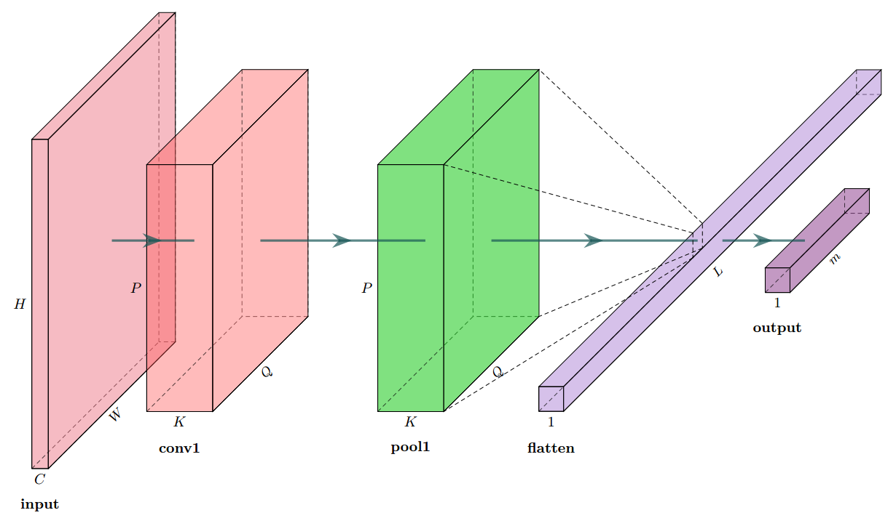
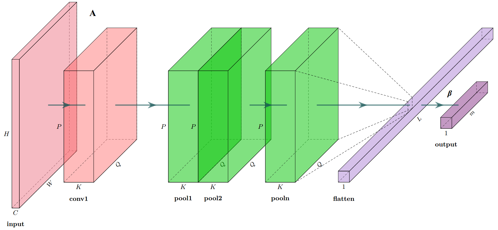

# HPELM

Hierarchical Pooling based Extreme Learning Machine for Image Classification

Please kindly cite the paper "Hierarchical Pooling based Extreme Learning Machine for Image Classification".
Bibtex:

@incollection{Liu.2020,
 author = {Liu, Yan and Liu, Zhi and Lei, Zhirong},
 title = {Hierarchical Pooling Based Extreme Learning Machine for Image Classification},
 pages = {1--9},
 volume = {594},
 publisher = {Springer},
 isbn = {978-981-32-9697-8},
 series = {Lecture notes in electrical engineering,   1876-1100},
 editor = {Jia, Yingmin and Du, Junping and Zhang, Weicun},
 booktitle = {Proceedings of 2019 Chinese Intelligent Systems Conference},
 year = {2020},
 address = {Singapore},
 doi = {10.1007/978-981-32-9698-5{\textunderscore }1}
}

